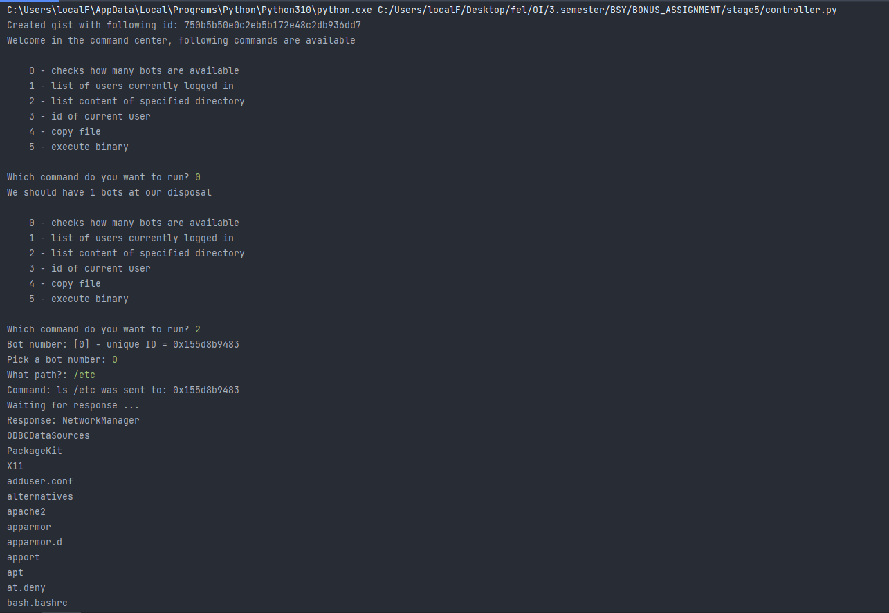
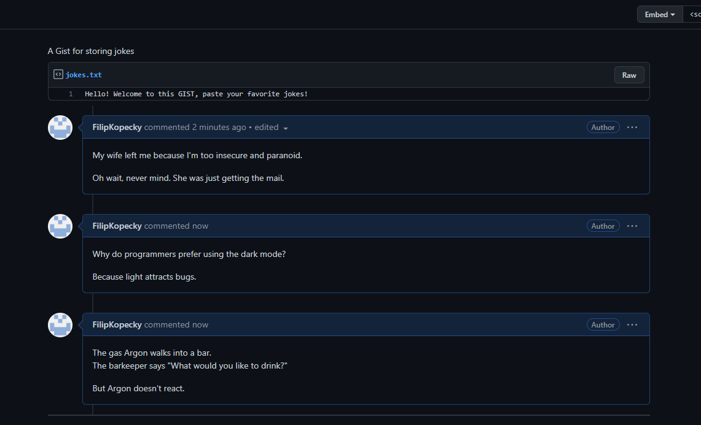

# bsy-bot
Stage 5 of BSY-BONUS
### IMPORTANT
Do not run this anywhere unless you know what you are doing. This is a school assignement and I don't take any responsibility by any harm caused by this code

### How to run
It is needed to modify GITHUB_TOKEN variable to a valid token in order for the code to work. Then you can run controller and bot

### How it works
Controller always start a new gist to which all the bots connect. Then all communication is hidden in a MARKDOWN comment and to avoid suspicion, all comments contain some joke. I don't take any responsibility for the jokes generated, they are taken from some site dynamically. 

### EXAMPLES
This is how the command center looks in action:

While the GIST looks all safe and sound

